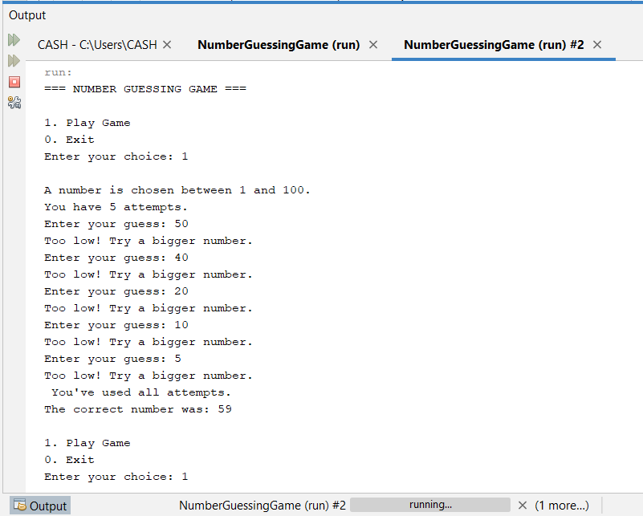

# Number-Guessing-Game
Number Guessing Game in Java where the computer randomly selects a number and the user must guess it correctly. The program should guide the user by giving hints and track performance.

# Game output

